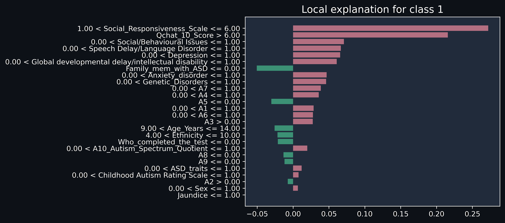

<h2 align="center"> Predicting Learning Disorder Rate in Children and Adolescents on the Autism Spectrum :hospital: </h2>

Learning disorder is common among children with ASD. Although autism itself is not a learning disability,
it can significantly affect a child’s ability to process and retain information. And as a result, hinders
their academic and social progress. Early diagnosis of children who may have chances of developing
learning disorder often helps to provide effective treatment.

This project aimed to develop a robust machine learning model to accurately predict learning
disorders in children. We used a dataset of 1985 children with ASD traits from https://www.kaggle.com/datasets/uppulurimadhuri/dataset, and we evaluated a 
variety of machine learning algorithms. Run ipynb file with the adjacent dataset. Our findings revealed outstanding accuracy in predicting 
learning disorders among children with ASD traits. Algorithms we used including K-Nearest 
Neighbors, Decision Tree Classifiers (using both Gini and Entropy criteria), Random Forest, 
and Naive Bayes (Gaussian) achieved accuracy levels surpassing 99%. This high level of accuracy
emphasizes the ability of these algorithms in accurately identifying individuals at
risk of developing learning disorders.

Incentive: The prediction of learning disorder is our machine learning final project of CSE445 course. more information can be found
 here https://rb.gy/3h795g

  

Cross-validation methods, such as Stratified Hold-Out,
Kfold, and Leave-One-Out Cross-Validation, were instrumental in ensuring the model’s generalization capabilities. These tech
niques not only assessed the model’s performance but also provided valuable insights into its consistency across various 
data splits. In addition to training the model with different techniques and checking its performance, we also explored 
explainable AI (XAI) using the Local Interpretable Model-agnostic Explanations (LIME) framework. This helped us not only 
understand how well various algorithms could make predictions but also made it clear why the model made specific decision

  

Future Enhancements: First
and foremost, obtaining a more extensive and diverse dataset, representative of various demographics, would significantly strengthen the external validity of our models. Exploring the integration of
longitudinal data could offer valuable insights into
the developmental trajectories of ASD traits and
their correlation with learning disorders over time.
We aim to collect dataset from children with ASD
traits from Bangladesh, so that we can get a better
prediction in the future.

